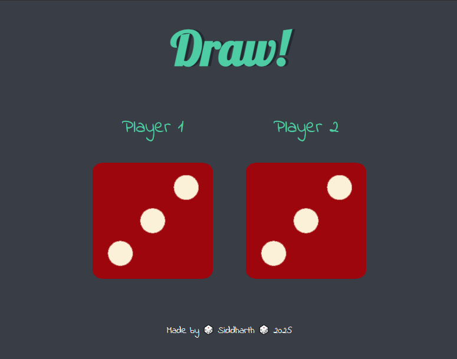
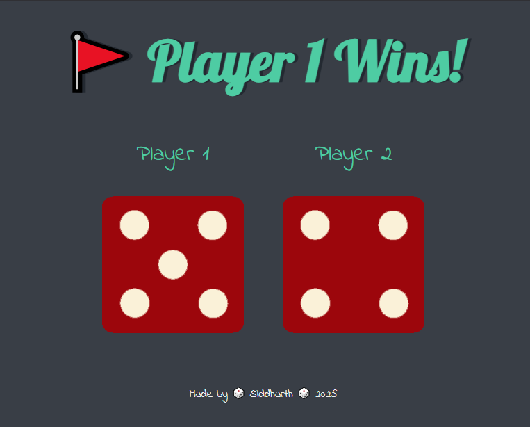
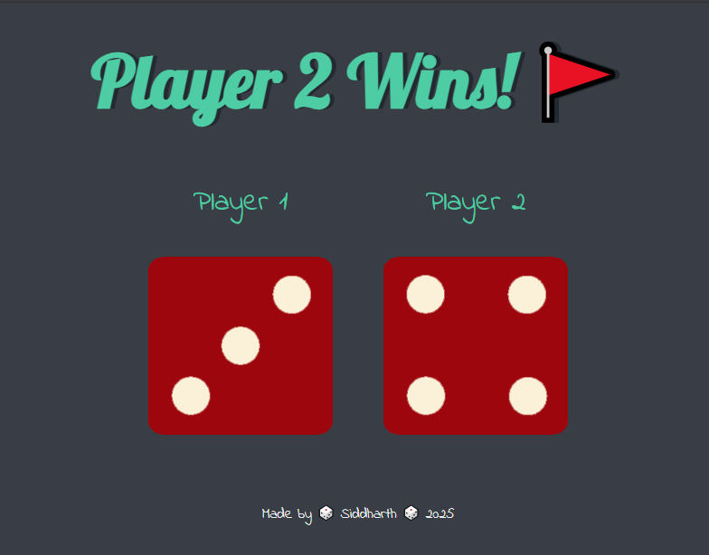

# Dice-Game
Dice Game is an exciting web-based game built using JavaScript, HTML, and CSS.

## Technologies Used
- HTML: Used for structuring the web page elements and creating the game layout.
- CSS: Implemented to style and enhance the visual aspects of the game.
- JavaScript: Leveraged to implement the game logic, handle user interactions, and generate random dice values.

